# Modelos Basados en Agentes

## Introducción

Nuestro modelo epidemiológico basado en agentes permite simular una sociedad virtual de agentes (i.e. personas) que se infectan con un virus, como el SARS-CoV-2, cuando interactúan directa (i.e. por contacto) o indirectamente (i.e. transmisión por aerosoles) con una persona infecciosa. Para obtener un entendimiento más detallado sobre los modelos epidemiológicos basados en agentes recomendamos la lectura del capítulo 1 del documento [_Epidemiología Matemática y COVID-19_](https://drive.google.com/file/d/1wPA1rOsiBwY_1y3Lgl9fNhL09NeRVpNX/view), escrito por nuestros investigadores. El objetivo de nuestro modelo es hacer análisis exploratorios de los mecanismos involucrados en la transmisión y desenlaces de la enfermedad en una población. De esta manera, el modelo no se usa para predecir las dinámicas de la epidemia (i.e. el número de casos incidentes en los próximos días de una epidemia), para lo cual son más apropiados los modelos compartimentales tipo SIR.

Ahora bien, un mecanismo está compuesto por elementos (o entidades) que realizan operaciones (o actividades) organizadas para producir el fenómeno de interés[1](#ref1) [2](#ref2) [3](#ref3). Al momento de incluir un mecanismo en un modelo debemos conocer sus componentes. Por su parte, el modelo nos permite comprender cómo los elementos del mecanismo operan y cómo se afectan unos con otros, pero además cómo afectan y se ven afectadas por los elementos de otros mecanismos [3](#ref3).

Pensemos, por ejemplo, en los elementos que componen el mecanismo de transmisión del SARS-CoV-2. Un primer elemento son las rutas de transmisión, que para este virus principalmente son aerosoles y microgotas contaminadas con el virus que emite la persona infectada [4](#ref4). Un segundo elemento son las condiciones del espacio donde interactúan las personas, por ejemplo, en espacios poco ventilados la transmisión por aerosoles podría tener una mayor importancia que las demás rutas de transmisión [4](#ref4). Un tercer elemento tiene que ver con el comportamiento de las personas, es decir, dependiendo del nivel de acatamiento de las medidas de bioseguridad, se podría dar lugar o no a un posible contagio [4](#ref4) [5](#ref5). Y un último elemento importante es el grado de infecciosidad de la persona contagiada, el cual depende a su vez del nivel de transmisibilidad de la variante del virus y del tiempo que ha transcurrido desde que la persona se infecta con el virus [5](#ref5).

Como nos pudimos dar cuenta, para incluir un mecanismo en un modelo debemos tener un conocimiento más o menos detallado del mismo. Pero además, el nivel de detalle que se requiera depende de la pregunta que el investigador desea responder con el modelo. Teniendo esto en cuenta, diseñamos un algoritmo computacional que permitiera configurar diferentes elementos de los mecanismos más importantes de la transmisión y desenlaces de la enfermedad. Esta configuración dependerá de las necesidades, preguntas y objetivos del investigador. El algoritmo se encuentra en la librería de acceso libre [_Contagious Disease Simulation_](https://github.com/fenfisdi/cdslab). Con este se pueden diseñar diferentes modelos epidemiológicos basados en agentes para analizar las dinámicas de una epidemia (con mecanismos similares a la epidemia del COVID-19) en una ciudad  o en un lugar determinado dentro de una ciudad.

Conceptualmente el algoritmo se divide en dos partes. La primera consiste de los mecanismos asociados a la transmisión y desenlace de la enfermedad.  La segunda incluye algunas estrategias farmacológicas y no-farmacológicas para mitigar o contener la epidemia. La primera parte se divide a su vez en cuatro  grupos de mecanismos. El primero son aquellos que determinan los encuentros entre las personas (i.e. densidad y movilidad); el segundo, tiene que ver con los determinantes del contagio (i.e. radio de dispersión del virus, comportamiento de las personas, nivel de infecciosidad, y nivel de susceptibilidad); el tercero, describe la historia natural de la enfermedad de las personas contagiadas; y el cuarto, permite caracterizar cada una de las personas y construir una sociedad heterogénea (i.e. diferentes edades, vulnerabilidades, susceptibilidades).

## Parte I: Mecanismos y parámetros de transmisión y desenlace de la enfermedad

En esta parte se describen los mecanismos incluidos en el algoritmo que permiten dar cuenta de las dinámicas de infección por el virus SARS-CoV-2 y los desenlaces de la enfermedad COVID-19. Como veremos el algoritmo es flexible y por tanto se puede usar para simular otras epidemias similares a la epidemia del COVID-19. En el [anexo 1](https://docs.google.com/document/d/1jBnrZ86xJQS-fT1CTl2pREDldh5hPzVAH2mYe7iZaA0/edit?usp=sharing) podemos ver ejemplos de los análisis que se pueden hacer modificando algunos parámetros.

Es importante aclarar que, el algoritmo actualiza en cada paso de tiempo (i.e. tiempo discreto) todos los procesos asociados a los mecanismos que se describen a continuación (e.g. cambiar la posición de los agentes, determinar si un agente se contagia o no, cambiar el estado de los agentes, etc). La escala temporal de cada paso de tiempo debe se ajustada desde el inicio, indicando a cuantas horas  corresponde cada paso temporal. Por ejemplo, si un paso temporal equivale a un día se debe ajustar como 24 horas. Adicionalmente, para ajustar los parámetros que indiquen temporalidad (e.g. las distribuciones de tiempo de permanencia en los estados -ver Mecanismos 3-) se debe considerar dicha escala temporal.

### 1. Mecanismos asociados al encuentro entre agentes

En cada momento del tiempo los agentes están ubicados explícitamente en el espacio, es decir, tienen una posición espacial que inicialmente es aleatoria ([Fig. 1A](#Fig.1A)) y que posteriormente se va actualizando en cada paso de tiempo. Esta actualización de la posición, o movimiento de los agentes, se lleva a cabo siguiendo una _**distribución de velocidades**_ que describe un  patrón particular de movimiento  ([Fig.1B](#Fig.1B)). La posición y las velocidades determinan los perfiles de movilidad de los agentes (i.e. algunos se mueven mucho, otros poco). Las dimensiones del espacio en el que se mueven los agentes se ajustan de tal manera que se conserve una _**densidad poblacional**_ deseada. Por ejemplo, para mantener una densidad de 0.0125 habitantes por metro cuadrado con 1000 agentes se debe configurar un área de 282 metros de _**longitud horizontal**_ por 282 metros de _**longitud vertical**_ del espacio ([Fig.1C](#Fig.1C)).

_**Figura 1.** Mecanismos que determinan los encuentros entre los agentes._
{: style="text-align: center;"}

<a id="Fig.1A">
    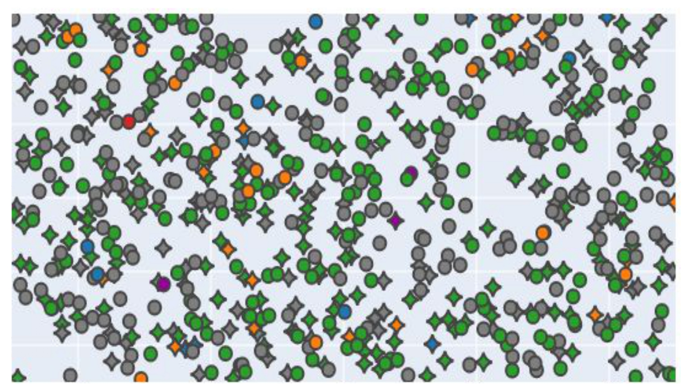
</a>

_**Fig.1A:** Esquema que captura la posición de los agentes en el espacio en cierto tiempo._
{: style="font-size: 80%;"}

<a id="Fig.1B">
    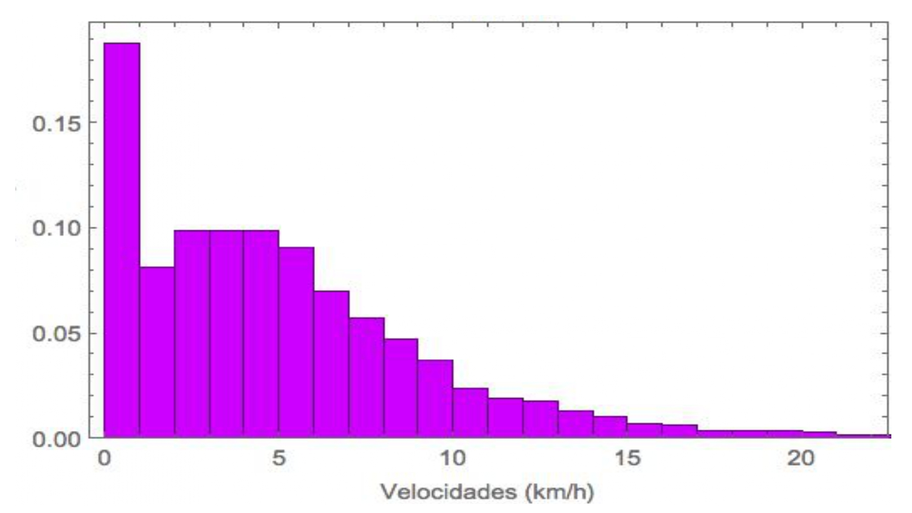
</a>

_**Fig.1B:** Distribución de velocidades de los agentes (extraído de encuestas origen destino para el 2017 en Medellín  [6](#ref6) [7](#ref7))._
{: style="font-size: 80%;"}

<a id="Fig.1C">
    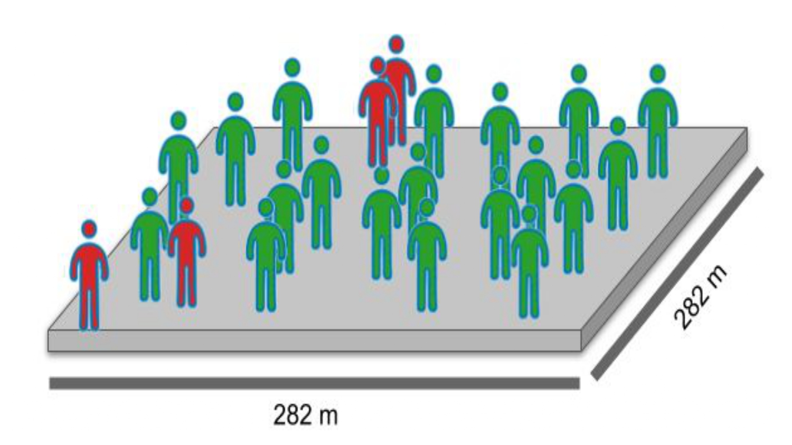
</a>

_**Fig.1C:** Dimensiones del espacio para mil agentes con densidad poblacional de 0.0125 habitantes por metro cuadrado._
{: style="font-size: 80%;"}

Lo anterior determina los encuentros o interacciones directas (i.e. por contacto) o indirectas (i.e. transmisión por aerosoles) entre los agentes y por tanto influye en la dinámica de contagio. Sin embargo, el contagio o la infección de los agentes depende de otros mecanismos que se describen más adelante. Finalmente, los parámetros asociados a estos mecanismos se describen en la [Tabla 1](#Tabla1).

<a id="Tabla1">
    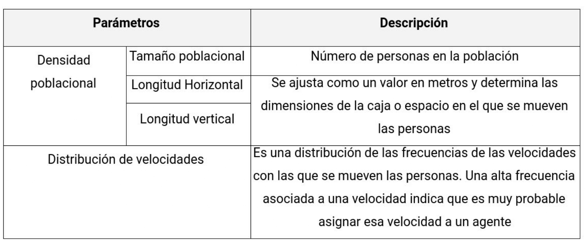
</a>

_**Tabla 1:** Parámetros asociados a los mecanismos que determinan los encuentros o interacciones entre los agentes_
{: style="font-size: 80%;"}

### 2. Mecanismos asociados al contagio

Los eventos de infección o contagio se pueden dar en cada paso del tiempo y de forma general se llevan a cabo de la siguiente manera. En primer lugar a los agentes infectados se les asocia un _**radio de dispersión**_ del virus o _**radio de contagio**_ (i.e. este determina un área alrededor de la cual el agente emite partículas virales) ([Fig. 2](#Fig.2)). Note que el tamaño de este radio da cuenta de la infecciosidad del agente infectado y del espacio particular donde este se encuentra, de tal manera que, radios más grandes equivalen a variantes virales más transmisibles y la transmisión en espacios cerrados poco ventilados.

<a id="Fig.2">
    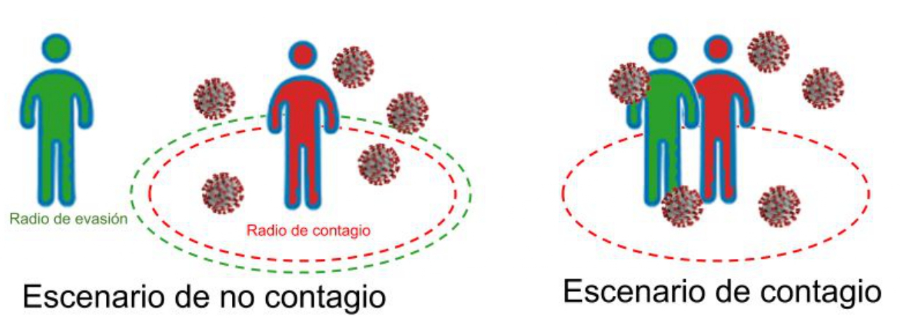
</a>

_**Figura 2:** Mecanismos asociados al contagio. **IZQUIERDA**  El escenario de no-contagio se da cuando el agente susceptible (verde) acata la norma de distanciamiento.  **DERECHA** El escenario de contagio se da cuando el agente susceptible (verde) entra en el radio de dispersión del agente infectado (rojo)._
{: style="font-size: 80%;"}

Luego, la posición espacial de cada agente susceptible (i.e. agente que se puede infectar) y su distancia con respecto a un agente infectado determina si el susceptible está dentro o fuera del radio de contagio. Esta posición además de estar dada por el movimiento del agente, como se explicó previamente, también depende del _comportamiento_ del mismo. Es decir, cada agente tiene asociado una probabilidad de acatar las normas de distanciamiento social (o _**probabilidad de estar alerta**_), y por tanto, una probabilidad de estar dentro o fuera del radio de contagio.  Aquellos individuos que acatan las normas de distanciamiento tienen a su vez asignado un _**radio de evasión**_ que debe ser más grande que el radio de contagio ([Fig. 2](#Fig.2)).

Finalmente, cuando un susceptible entra en el radio de dispersión de un agente infectado se da lugar a un posible contagio. Este es un evento probabilístico que depende del _**nivel de susceptibilidad**_ y el _**nivel de inmunidad**_ del agente susceptible y el nivel de infecciosidad (o _**probabilidad de dispersar el virus**_ ) del infectado. En la [Tabla 2](#Tabla2) podemos observar los parámetros asociados al contagio.

<a id="Tabla2">
    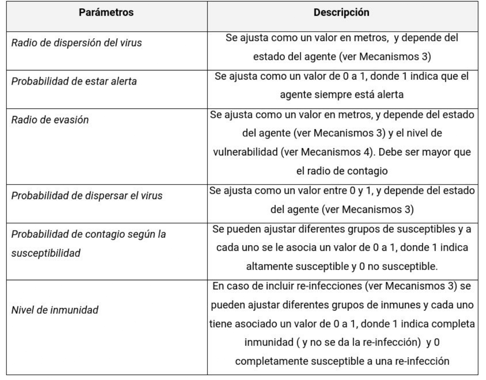
</a>

_**Tabla 2:** Parámetros asociados a los mecanismos que determinan los encuentros o interacciones entre los agentes._
{: style="font-size: 80%;"}

### 3. Mecanismos asociados al desenlace de la infección-enfermedad

Una vez contagiado, un agente transita a través de una serie de **estados que describen la historia natural** de la infección-enfermedad. En la [Figura 3](#Fig.3) se muestra una configuración particular de la historia natural, pero el algoritmo permite configurar otras versiones. En cada uno de estos estados los agentes permanecen por un tiempo que se  asigna a cada uno de forma aleatoria e independiente y según una **distribución de tiempos** de permanencia o tiempos de vida media por estado ([Fig. 3](#Fig.3)).  Una vez ha transcurrido el tiempo en un estado los  agentes transitan a un siguiente estado según una **probabilidad de transición**.

<a id="Fig.3">
    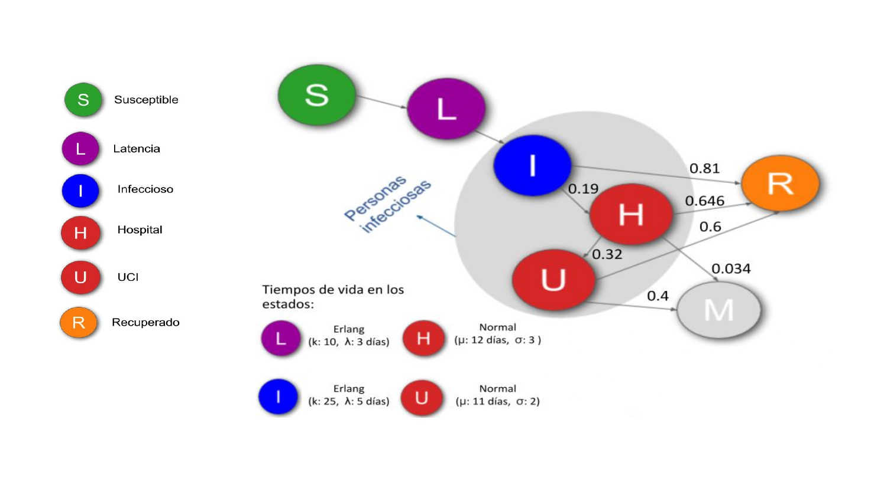
</a>

_**Figura 3:**  Una posible versión de la historial natural de la infección del COVID-19. Se indican los estados y las conexiones entre estos (flechas negras), las probabilidades de transición (valores cerca de las flechas, el valor es 1 cuando no hay un número cerca de una flecha), y los tiempos de permanencia en cada estado (esquina inferior derecha). La latencia (L) es el periodo durante el cual el agente, aunque infectado, no es contagioso. Por el contrario, en el periodo de infecciosidad (I) estan todos los agentes infecciosos que aún se encuentran incubando el virus, o son asintomáticos o sintomáticos leves. Posteriormente los agentes se pueden recuperar (R) o agravar ocupando una cama de hospital y/o UCI (H, U). Desde estos últimos dos estados los agentes pueden recuperarse o morir (M)._
{: style="font-size: 80%;"}

En este punto es importante aclarar varias cosas. Primero, en el diagrama de la [Figura 3](#Fig.3) no  incluyen re-infecciones, en caso de que se quiera configurar una versión que sí incluya este factor solo se debe adicionar una transición del estado Recuperado al estado Susceptible. Segundo, la suma total de las probabilidades de transición de un estado a los estados inmediatamente siguientes deber ser uno (i.e. para la [Figura 3](#Fig.3) la transición del estado I al R es 0.81 y del I al H es 0.19, en total 1). Tercero, en cada paso de tiempo el algoritmo actualiza el estado de los agentes y  esto depende, como se mencionó previamente, de los tiempos de permanencia en cada estado y de las probabilidades de transición. Las cuales a su vez dependen de las características de cada agente (como veremos en la siguiente sesión). Finalmente, las **variables de estado** del modelo son los estados descritos en la historia natural y la incidencia de casos nuevos en cada paso de tiempo.

<a id="Tabla3">
    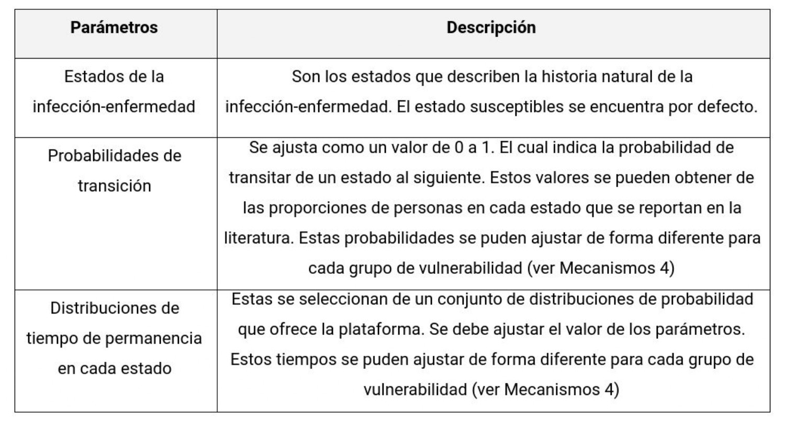
</a>

_**Tabla 3:** Parámetros asociados a los mecanismos que determinan el desenlace de la infección - enfermedad._
{: style="font-size: 80%;"}

### 4. Mecanismos que describen una población heterogénea

Las poblaciones simuladas pueden ser heterogéneas, es decir, pueden estar compuestas por un conjunto variado de agentes que difieren en **edad**, grado de **vulnerabilidad**, nivel de **susceptibilidad**, y nivel de **inmunidad**. La vulnerabilidad está definida como la mayor tendencia que tienen algunas personas a enfermarse gravemente y morir por la enfermedad, de esta manera, por nivel de vulnerabilidad se pueden ajustar diferentes probabilidades de transición y tiempos de permanencia entre los estados anteriormente mencionados.

<a id="Fig.4">
    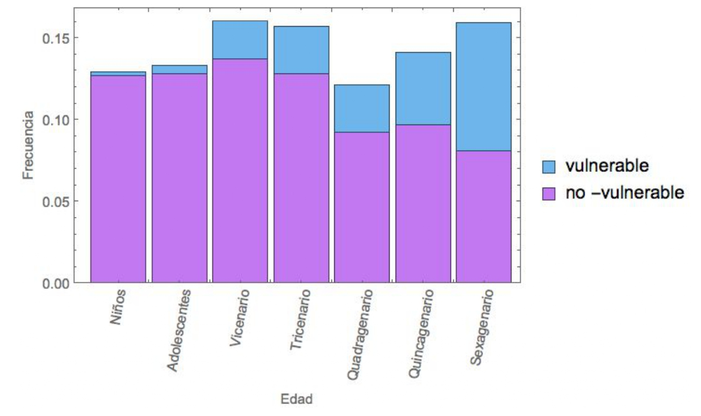
</a>

_**Figura 4:** Grupos etarios y porcentaje de vulnerables por grupo para Medellín._
{: style="font-size: 80%;"}

<a id="Tabla4">
    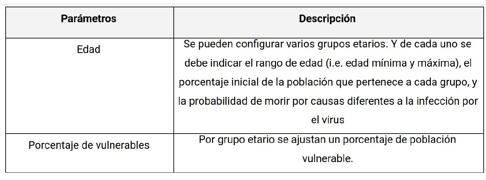
</a>

_**Tabla 4:** Parámetros asociados a los mecanismos que describen la heterogeneidad de la población._
{: style="font-size: 80%;"}

### 5. Mecanismos asociados a la asistencia médica

Para cada estado de la enfermedad y considerando el nivel de vulnerabilidad, se debe indicar si las personas transitando dicho estado requieren una cama hospitalaria o una Unidad de Cuidados Intensivos (UCI). Además, se debe indicar la cantidad de camas hospitalarias y de UCI que se encuentran disponibles. Con esta información el algoritmo actualiza en cada paso de tiempo la ocupación de estos recursos de asistencia médica. A partir de esto se pueden tomar decisiones de salud pública como decretar cuarentena, lo cual se describirá en la siguiente sección.

<a id="Tabla5">
    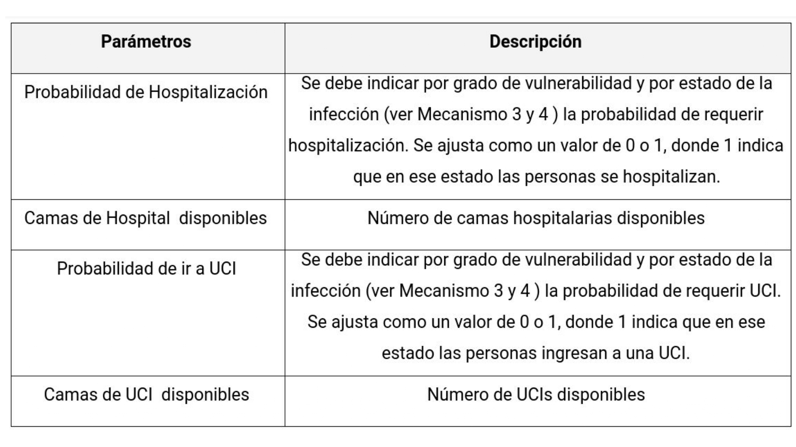
</a>

_**Tabla 5:** Parámetros asociados a la asistencia médica._
{: style="font-size: 80%;"}

## Parte II: Estrategias farmacológicas y no-farmacológicas de mitigación o contención

En esta parte se describen las estrategias farmacológicas y no-farmacológicas de mitigación o contención que se pueden simular con este algoritmo. Como veremos el algoritmo es flexible y por tanto se puede usar para simular una variedad de estrategias. En el [anexo 2](https://docs.google.com/document/d/1PHj3pt_Q3VRVQsPkRHERgbTzWvyxIGTtv8jvcb1TfzI/edit?usp=sharing) podemos ver ejemplos de algunas estrategias evaluadas. Adicionalmente, algunas estrategias se pueden aplicar a grupos particulares y previamente definidos. Es decir, se pueden formar grupos por edades, por nivel de vulnerabilidad, susceptibilidad, o inmunidad, a los cuales se les aplica las estrategias de forma diferencial como veremos más adelante.

### 1. Diagnostico

El modelo permite evaluar el efecto del diagnóstico sobre las dinámicas de infección. Para lo cual se considera la **probabilidad que tienen los individuos de ser diagnosticados** dependiendo del estado (ver Mecanismos 3) en el que se encuentren, es decir, un enfermo grave a diferencia de un asintomático tendrá mayor **probabilidad de ser diagnosticado** ([Tabla 6](#Tabla6)). Además se incluye el **tiempo que permanece aislado** un agente diagnosticado como positivo para el virus ([Tabla 5](#Tabla5)).

<a id="Tabla6">
    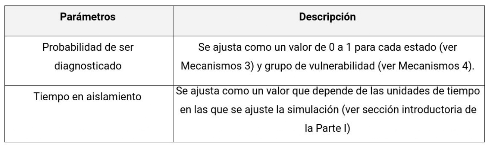
</a>

_**Tabla 6:** Parámetros asociados al diagnóstico._
{: style="font-size: 80%;"}

### 2. Cuarentenas decretadas en diferentes tiempos

El modelo permite decretar cuarentenas por ventanas de tiempo de cierta duración a uno o varios grupos de la población. Asi pues, se puede ajustar un solo grupo que entra y sale de cuarentena estricta por periodos de tiempo, o se pueden ajustar varios grupos que entran y salen de cuarentena estricta por periodos de tiempo. En las Figuras [5](#Fig.5) y [6](#Fig.6) se dan algunos ejemplos de estas estrategias y en la [Tabla 7](#Tabla7) se describen los parámetros que se deben ajustar.

<a id="Fig.5">
    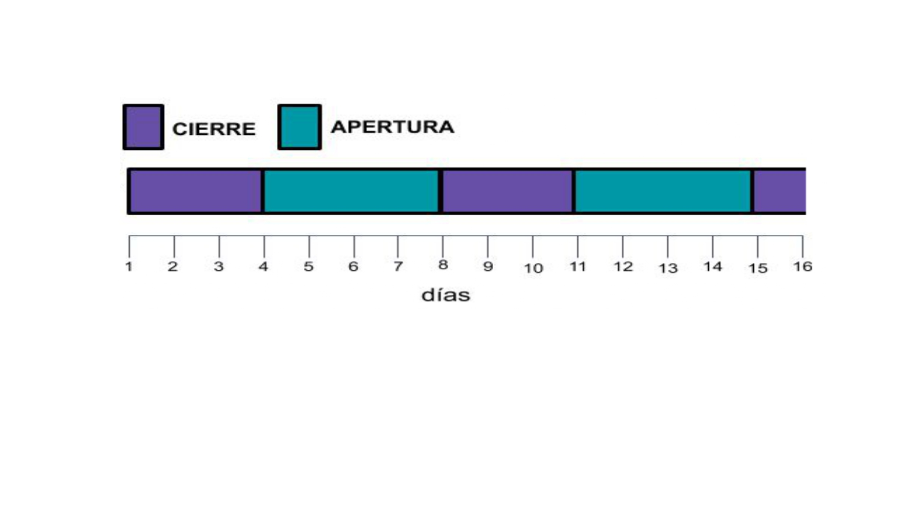
</a>

_**Figura 5:** Estrategias cíclicas o de acordeón.  A manera de ejemplo, se  representa la estrategia 3/4 con tres días de cierre y cuatro de apertura de las actividades sociales y económicas._
{: style="font-size: 80%;"}

<a id="Fig.6">
    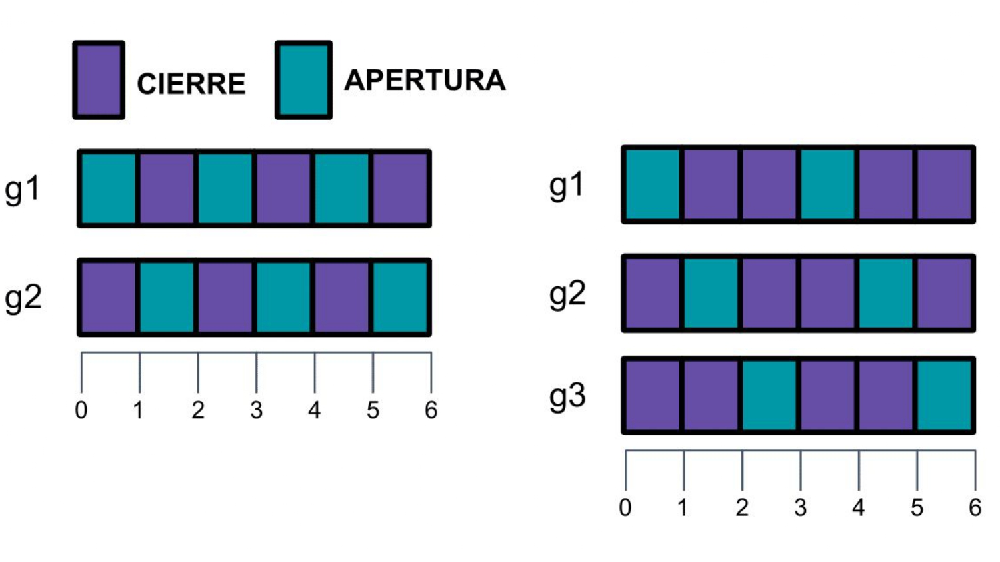
</a>

_**Figura 6:** Representación gráfica de las estrategias de pico y cédula.  En la imagen se representan dos estrategias: a la **IZQUIERDA** la estrategia con dos grupos (2G) y a la **DERECHA** la estrategia con tres grupos (3G). CIERRE indica que el grupo no está activo y no puede movilizarse libremente, y APERTURA indica que el grupo está activo y  puede movilizarse libremente. La barra numérica indica el tiempo en días._
{: style="font-size: 80%;"}

<a id="Tabla7">
    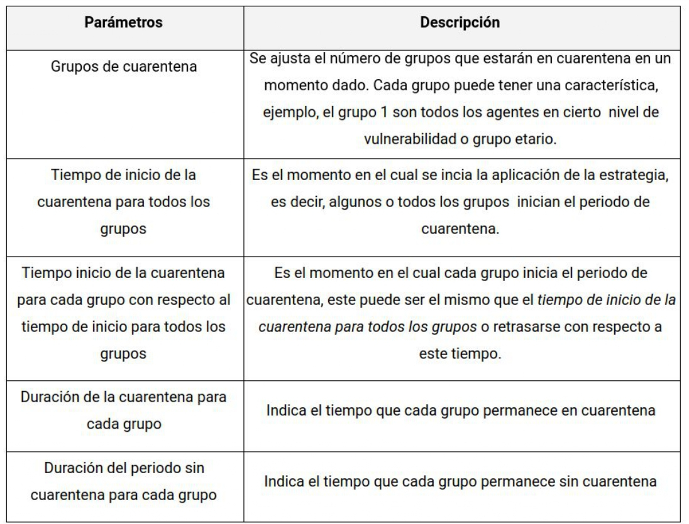
</a>

_**Tabla 7:** Parámetros asociados a las cuarentenas decretadas en diferentes tiempos._
{: style="font-size: 80%;"}

### 3. Cuarentenas decretadas según ocupación del sistema de salud

El algoritmo permite para uno o diferentes grupos de la población decretar cuarentenas cuando los recurso hospitalarios (i.e. camas de hospital y UCI) han sobrepasado un umbral de ocupación. En la [Tabla 8](#Tabla8) se  describen los parámetros que se deben ajustar.

<a id="Tabla8">
    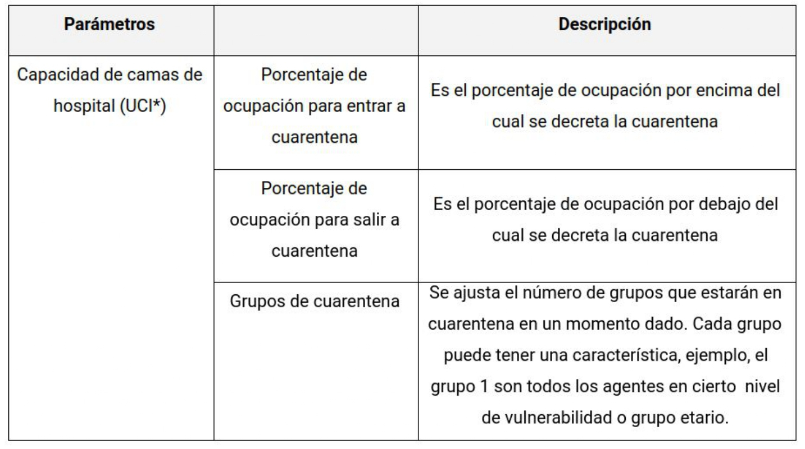
</a>

_**Tabla 8:** Parámetros asociados a las cuarentenas decretadas según ocupación del sistema de salud. * Estos mismos parámetros aplican para la ocupación de UCIs._
{: style="font-size: 80%;"}

### 4. Cuarentenas decretadas según variables poblacionales

El algoritmo permite para uno o diferentes grupos de la población decretar cuarentenas cuando algunas variables poblacionales (i.e. número de muertos por la enfermedad y número de diagnosticados) han sobrepasado un umbral. En la [Tabla 9](#Tabla9) se  describen los parámetros que se deben ajustar.

_**Tabla 9:** Parámetros asociados a las cuarentenas decretadas según variables poblacionales. * Estos mismos parámetros aplican para las cuarentenas decretadas por número de diagnosticados._
{: style="font-size: 80%;"}

## Resumen del proceso y planeación

Los siguientes diagramas resumen los procesos de los cuales se compone el algoritmo (Figuras [7a](#Fig.7a)-[7d](#Fig.7d)).

<a id="Fig.7a">
    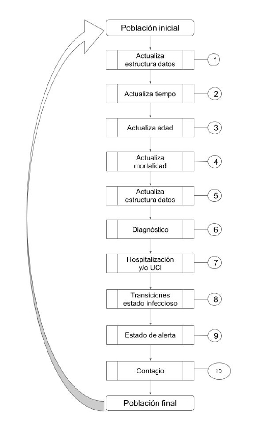
</a>

_**Figura 7a:**  Diagrama general del orden de  los procesos._
{: style="font-size: 80%;"}

<a id="Fig.7b">
    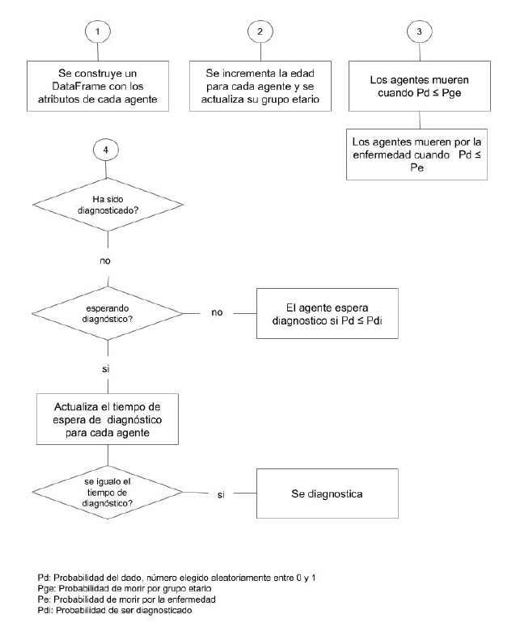
</a>

_**Figura 7b:**  Diagrama general de los procesos 1 al 4._
{: style="font-size: 80%;"}

<a id="Fig.7c">
    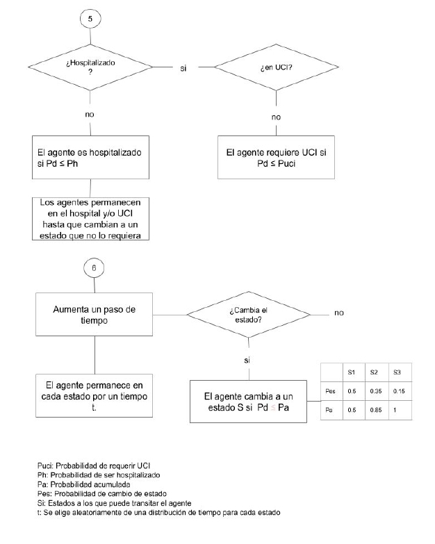
</a>

_**Figura 7c:**  Diagrama general de los procesos 5 al 6._
{: style="font-size: 80%;"}

<a id="Fig.7d">
    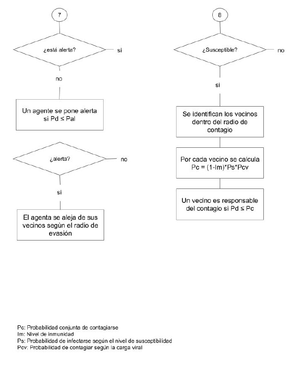
</a>

_**Figura 7d:**  Diagrama general de los procesos 7 al 8._
{: style="font-size: 80%;"}

## Referencias

<a id="ref1">1</a>: Sloan PR. Discovering Complexity: Decomposition and Localization as Strategies in Scientific Research. William Bechtel , Robert C. Richardson [Internet]. Vol. 85, Isis. 1994. p. 746–7. Available from: http://dx.doi.org/10.1086/357068
    [↩](#backref1)

<a id="ref2">2</a>: Bechtel W, Abrahamsen A. Explanation: a mechanist alternative [Internet]. Vol. 36, Studies in History and Philosophy of Science Part C: Studies in History and Philosophy of Biological and Biomedical Sciences. 2005. p. 421–41. Available from: http://dx.doi.org/10.1016/j.shpsc.2005.03.010
    [↩](#backref2)

<a id="ref3">3</a>: Bechtel W, Abrahamsen AA. Mechanism, Dynamic [Internet]. Encyclopedia of Systems Biology. 2013. p. 1204–7. Available from: http://dx.doi.org/10.1007/978-1-4419-9863-7_72
    [↩](#backref3)

<a id="ref4">4</a>: Greenhalgh T, Jimenez JL, Prather KA, Tufekci Z, Fisman D, Schooley R. Ten scientific reasons in support of airborne transmission of SARS-CoV-2. Lancet. 2021 May 1;397(10285):1603–5.
    [↩](#backref4)

<a id="ref5">5</a>: GVN. How Long Is A SARS-CoV-2 Infected Person Contagious? [Internet]. 2020 [cited 2021 May 20]. Available from: https://gvn.org/how-long-is-a-sars-cov-2-infected-person-contagious/
    [↩](#backref5)

<a id="ref6">6</a>: Área Metropolitana del Valle de Aburrá [Internet]. [cited 2020 Dec 2]. Available from: https://datosabiertos.metropol.gov.co/dataset/encuesta-origen-destino-2017-datos-por-hogares
    [↩](#backref6)

<a id="ref7">7</a>: Área Metropolitana del Valle de Aburrá [Internet]. [cited 2020 Dec 2]. Available from: https://datosabiertos.metropol.gov.co/dataset/encuesta-origen-destino-2017-datos-por-viajes
    [↩](#backref7)
