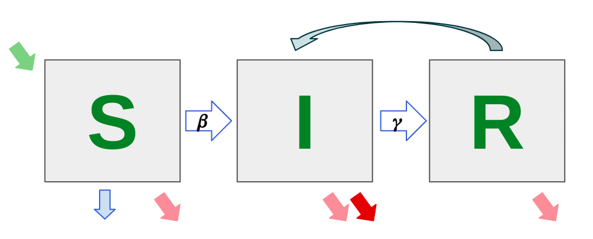
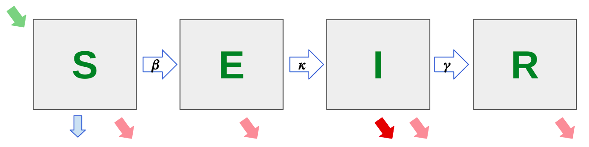
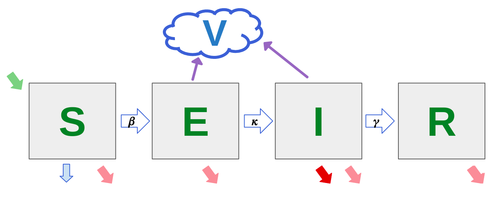

# Modelos compartimentales

**Tabla de contenido**

1. Descripción de los modelos compartimentales disponibles

    1. Modelo SIR

    2. Modelo SEIR

    3. Modelo SEIRV

2. Características de las variables de estado de los modelos

    4. Susceptibles (S)** **

    5. Expuestos (E)

    6. Infectados (I)

    7. Recuperados (R)

    8. Virus (V)

3. Descripción de los parámetros de cada modelo

    9. Modelo SIR

        1. Tasas de entrada al sistema / Proporción de Natalidad

        2. Proporción de muerte natural / Tasa de salidas del sistema

        3. Proporción de muerte debida a la enfermedad

        4. Tasa de transmisión 

        5. Tasa de vacunación 

        6. Tasa de recuperación 

        7. Tasa de reinfección

        8. Tasa de pérdida de inmunidad

    10. Modelo SEIR

        9. Tasa de entradas al sistema / Proporción de Natalidad

        10. Proporción de muerte natural / Tasa de salidas del sistema

        11. Periodo de incubación

        12. Tasa de muerte debida a la enfermedad

        13. Tasa de vacunación 

        14. Tasa de recuperación 

        15. Constante de transmisión entre S y E

        16. Constante de transmisión entre S e I

    11. Modelo SEIRV

        17. Proporción de Natalidad

        18. Proporción de muerte natural

        19. Periodo de incubación 

        20. Proporción de muerte debida a la enfermedad

        21. Tasa de recuperación 

        22. Tasa de dispersión del virus por personas Expuestas

        23. Tasa de dispersión del virus por personas Infectadas

        24. Tasa de remoción del virus

        25. Constante de transmisión entre S y E

        26. Constante de transmisión entre S e I

        27. Constante de transmisión entre S y V

        28. Coeficiente de ajuste de transmisión 

4. Instrucciones para realizar la simulación

    12. Tipos de simulación

        29. Parámetros fijos

        30. Ajuste de parámetros 

    13. Fuentes de datos

        31. Datos propios

        32. Datos del INS para COVID19

5. Consideraciones matemáticas de los modelos

6. Cómo interpretar los resultados del modelo 

    14. Archivos finales de la plataforma

7. Observaciones adicionales del equipo FenFiSDi. 

1. **Descripción de los modelos compartimentales**

Los modelos compartimentales son modelos dinámicos útiles para describir la transmisión de enfermedades muy usados en epidemiología. Ellos dividen la población en compartimentos, los cuales corresponden a una variable de estado que indica la cantidad de individuos que se encuentran en una etapa específica de la enfermedad [[1]](https://paperpile.com/c/GKx5pD/vLID). También  realizan supuestos sobre la naturaleza y velocidad a la cual se mueven de un compartimento a otro en el tiempo [[2]](https://paperpile.com/c/GKx5pD/PGRg); y son útiles para predecir tendencias y evaluar medidas de control [[3]](https://paperpile.com/c/GKx5pD/0TUf). En estos modelos se asume que [[4]](https://paperpile.com/c/GKx5pD/bQoV):

* Hay una mezcla homogénea de la población en el sentido de que la probabilidad de que un individuo haga contacto con todos los otros individuos de la población es la misma independientemente del compartimiento al que pertenezcan, en otras palabras, todos los individuos están igualmente distribuidos en el espacio.

* Todos los individuos susceptibles son igualmente susceptibles.

* Todos los individuos infecciosos son igualmente infecciosos independientemente de cuándo fue infectado un individuo o cuánto tiempo lleva infectado.

 A continuación se presenta una descripción de los modelos usados en esta plataforma: 

1. **Modelo SIR**

El modelo SIR es el modelo más básico para describir la transmisión de una enfermedad que confiere inmunidad contra reinfección [[2]](https://paperpile.com/c/GKx5pD/PGRg). Este modelo clasifica a los individuos en tres compartimentos: Susceptibles (S), Infectados (I) y recuperados (R), (ver descripción más adelante), dependiendo de los supuestos del modelo, este puede tener o no, en cuenta la tasa de natalidad y mortalidad de la población, la tasa de muerte por la enfermedad o la tasa de vacunación. **Nota: **En infecciones en las que un individuo infectado atraviesa su período infeccioso y se recupera sin adquirir inmunidad, se debe utilizar un modelo SIS. También puede suceder que los individuos recuperados vuelvan a sustituir la población de susceptibles a través de un mecanismo de pérdida de inmunidad, mientras la población misma es cerrada, en este caso se tiene un modelo tipo SIRS [[2]](https://paperpile.com/c/GKx5pD/PGRg). Las enfermedades causadas por virus pueden usualmente ser descritas por modelos tipo SIR [[2]](https://paperpile.com/c/GKx5pD/PGRg). 

2. **Modelo SEIR**

Los compartimentos del modelo SEIR son: Susceptibles (S), Expuestos (E), Infectados (I) y recuperados (R). Este modelo tiene un compartimento adicional al modelo SIR que son los Expuestos (E), cuyos individuos están infectados, pero no son capaces de transmitir la infección a los individuos susceptibles a través de contacto [[4]](https://paperpile.com/c/GKx5pD/bQoV), por lo tanto, los individuos expuestos (E) transitan a los individuos Infectados (I) cuando se vuelven infecciosos (periodo latente), y puede que aún no hayan manifestado síntomas. Este compartimiento E permite describir la enfermedad de manera más exacta, ya que el periodo de incubación es diferente del periodo latente [[1]](https://paperpile.com/c/GKx5pD/vLID).

La diferencia entre el periodo de incubación y el periodo de latencia, denotada con el término ω [[5]](https://paperpile.com/c/GKx5pD/abUj), ver Figura 1, puede ser positiva para enfermedades infecciosas en las cuales la latencia es menor a la incubación. Los contagios por parte de personas infecciosas presintomáticas reciben el nombre de contagios subclínicos. Enfermedades infecciosas como el COVID-19 o más notoriamente el VIH presentan este comportamiento. Otro posible escenario infeccioso es cuando ω es negativo, esto ocurre cuando la incubación es más corta que la latencia y se presenta en enfermedades como el SARS en el que la mayoría de infecciones ocurren cuando personas susceptibles están en contacto con infectados en momentos tardíos de su enfermedad [[6]](https://paperpile.com/c/GKx5pD/MsAy), estas infecciones reciben el nombre de infecciones clínicas. Una última posibilidad es que la latencia y la incubación duren aproximadamente lo mismo donde ω es igual a cero, un caso representativo de este tipo de enfermedades infecciosas es la viruela en donde el inicio de síntomas es señal clara de inicio de infecciosidad [[7]](https://paperpile.com/c/GKx5pD/Ps8r). **Nota: **A pesar de que para el COVID-19 se ha discutido que las personas infectadas comienzan a ser infecciosas antes de presentar síntomas (ω positivo), no se ha logrado determinar la duración exacta de ese periodo latente, por lo tanto algunos modelos asumen que el periodo latente es igual al periodo de incubación.

Fig 1. La diferencia entre el periodo de incubación y el periodo de latencia está descrita con el término ω y puede tener uno de tres comportamientos: **A.** ω>0: los síntomas inician luego de que inicia la infecciosidad, esto lleva a la existencia de infecciones subclínicas. **B.** ω<0: los síntomas inician antes de que inicie la infecciosidad, todas las infecciones son clínicas. **C.** ω=0: los síntomas inician al mismo tiempo en el que inicia la infecciosidad.

3. **Modelo SEIRV**

Este es un modelos tipo SEIR con algunas modificaciones donde se considera que los individuos expuestos (E) están en el periodo de incubación, no muestran síntomas, pero pueden infectar a otras personas y los individuos infectados (I) son aquellos que han desarrollado completamente los síntomas de la enfermedad y también pueden contagiar o infectar a otros. El compartimento adicional al modelo SEIR que es el virus (V) representa la concentración  de este en el ambiente. Este modelo divide la población en cinco clases de individuos: Susceptibles (S), Expuestos (E), Infectados (I), recuperados (R) y Virus (V).

2. **Características de las variables de estado de los modelos**

1. **Susceptible (S): **Individuos que no tienen inmunidad y que pueden adquirir la infección a un ritmo determinado si entran en contacto con un individuo infeccioso [[8]](https://paperpile.com/c/GKx5pD/LCLV). 

2. **Expuesto (E): **Para el modelo SEIR son individuos que están infectados, pero no son capaces de transmitir la infección a otros individuos susceptibles a través de contactos [[4]](https://paperpile.com/c/GKx5pD/bQoV). Y los individuos permanecen en esta clase durante un periodo de tiempo llamado **periodo latente. **Para el modelo tipo SEIRV los individuos en la clase expuestos se encuentran en periodo de incubación, no muestran síntomas pero son capaces de infectar a otros, es decir, contienen individuos infecciosos asintomáticos.. En nuestro modelo SEIRV, los expuestos son individuos infecciosos pero asintomáticos.

 

3. **Infectado o infeccioso (I):** Para *el modelo SIR* son los individuos que transmiten la enfermedad a personas susceptibles y permanecen en esta clase durante un período de tiempo conocido como **período infeccioso**, antes de pasar a la clase recuperada o eliminada, [[6]](https://paperpile.com/c/GKx5pD/oNEa), Los individuos se vuelven infecciosos inmediatamente después de haber sido infectados, sin pasar por un periodo latente. Para *el modelo SEIR y SEIRV* son los individuos que han desarrollado completamente los síntomas de la enfermedad y pueden infectar a otras personas, en otras palabras son individuos infectados sintomáticos, que han iniciado su periodo infeccioso antes del inicio de síntomas [[7]](https://paperpile.com/c/GKx5pD/xMb4).

4. **Recuperado (R): **Indica el número de personas que se han infectado y sin probabilidad de volver a infectarse o de propagar la infección [[2]](https://paperpile.com/c/GKx5pD/PGRg). Entiéndase eliminan como: aislamiento del resto de la población, inmunización contra la infección (vacunas), inmunidad adquirida por recuperación de la enfermedad sin posibilidad de reinfección, muerte causada por la enfermedad [[2]](https://paperpile.com/c/GKx5pD/PGRg). 

5. **Virus (V): **Representa la concentración del virus en el reservorio ambiental. Este compartimento contempla el hecho de que los individuos susceptibles podrían contraer la enfermedad del ambiente contaminado [[10]](https://paperpile.com/c/GKx5pD/xMb4).

3. **Descripción de los parámetros de cada modelo**

Los parámetros en los modelos matemáticos, casi siempre están dados en términos de tasas. Entiéndase **tasa** como un cambio por unidad de tiempo, por ejemplo: metros por segundo, pulsaciones por minuto, infectados por día, etc., nos referimos a una razón dónde las unidades del denominador están dadas en tiempo. **Nota:** La definición de tasa usada acá, es diferente de la definición de tasa en epidemiología. 

    1. **Modelo SIR **(ver Fig 2)

        1. **Tasa de Natalidad/entradas al sistema**

La tasa de natalidad es la proporción de nacidos vivos en una población específica, con relación a la población total en un periodo de tiempo específico. **Nota**: Dado que el valor reportado tradicionalmente se da en términos de una tasa epidemiológica, es decir, está multiplicado por una constante en un periodo semestral o anual (ej. 1000, 10.000, 100.000), se debe realizar la división de la tasa de natalidad entre la constante y el número de días de un semestre o un año para obtener la proporción correcta que se ingresa al modelo. Por ejemplo: si tenemos una tasa de 25 nacidos vivos por cada 1000 habitantes de una región en particular en un año, entonces la proporción de natalidad es: 25/(1000 x 360) personas nacidas vivas/día = 0,0000694 personas nacidas vivas/día.

En este parámetro se pueden incluir o sumar a la tasa de natalidad, otras entradas al sistema, como la tasa de migración, o sea, el número de personas/día que llegan o entran a la población.

Si el usuario está usando parámetros fijos y se quiere simular un modelo SIR asumiendo un sistema cerrado sin cambios en la tasa de nacimientos y muertes naturales durante un periodo corto del brote, entonces se asigna un valor de cero a este parámetro. 

        2. **Tasa de muerte natural (por causas diferentes a la enfermedad de estudio)**

Proporción entre el número de defunciones en una población durante un año específico y la población total a mitad de año. **Nota**: Dado que este dato viene multiplicado por una constante y casi siempre es anual, se debe corregir de manera similar a las indicaciones dadas en la nota de proporción de natalidad. Si el usuario está usando parámetros fijos y no quiere tener en cuenta este parámetro, se le asigna un valor de cero.

        3. **Tasa de muerte debida a la enfermedad o tasa de fatalidad por caso (CFR):**

Proporción de personas que mueren por la enfermedad, entre el número de casos diagnosticados en un día [[11]](https://paperpile.com/c/GKx5pD/XVgN).

        4. **Tasa de transmisión: **

Velocidad a la cual un individuo susceptible se mueve al compartimento de infectados. Es calculado como el producto entre la tasa de contacto (número de contactos del sujeto) (*c*) y la probabilidad de que el contacto entre un individuo susceptible y un infectado resulte en una transmisión (*p*). Es decir: *tasa de transmisión* = *p *x *c **[[1*]](https://paperpile.com/c/GKx5pD/vLID). Usualmente recibe el nombre de 𝜷.

        5. **Tasa de vacunación **

Proporción de personas vacunadas (dosis completa) sobre la población total de un periodo de tiempo específico.** Nota:** Tener en cuenta hacer el ajuste del periodo de tiempo de la proporción por día. Si el usuario no quiere tener en cuenta este parámetro o no se tiene una vacuna disponible, se le asigna un valor de cero.

        6. **Tasa de recuperación**: 

Es el periodo de tiempo promedio que tarda un individuo en dejar de ser infeccioso, equivale al inverso del promedio del** periodo infeccioso** (tiempo promedio que un individuo permanece infectando a otros). Tasa de recuperación = 1/periodo infeccioso (1). En la literatura recibe el nombre de 𝜸.

        7. **Tasa de reinfección**

Proporción de personas que habiendo tenido la enfermedad (recuperadas) se infectan nuevamente por la misma enfermedad, es decir, número de individuos reinfectados entre el número total de individuos recuperados en un periodo de tiempo específico (día). **Nota**: En términos de los modelos compartimentales, son aquellas personas que pasan de un estado recuperado a infeccioso, nuevamente. Si el usuario está usando parámetros fijos y la enfermedad evaluada no presenta reinfección, se le asigna un valor de cero a este parámetro.

        8. **Tasa de pérdida de inmunidad**

Periodo de tiempo que tarda un individuo recuperado en volver a ser susceptible. Es equivalente al inverso del tiempo que tarda una persona en perder la inmunidad. Por ejemplo, si una persona tarda 180 días en perder la inmunidad, la tasa de pérdida de inmunidad será: 1/180 = 0.0055 días-1. **Nota:** Si el usuario está usando parámetros fijos y la enfermedad no presenta pérdida de inmunidad, se le asigna un valor de cero a este parámetro.

 

Fig 2. Representación esquemática de modelo tipo SIR y algunos de sus posibles parámetros con dinámicas vitales. S representa a los susceptibles, I a los infectados y R recuperados. Las tasas de las dinámicas vitales están representadas por la flecha verde (natalidad) y flechas rosadas (mortalidad no asociada a la enfermedad modelada), la tasa de transmisión está representada por la flecha β, la tasa de recuperación por la flecha γ, la tasa de reinfección está representada por la flecha con origen en R dirigida a I , la tasa de vacunación por la flecha azul y la flecha roja representa la CFR o tasa de mortalidad por la enfermedad.

    2. **Modelo SEIR **(ver Fig 3)

        9. **Tasa de Natalidad**

Proporción de nacidos vivos en una población específica, con relación a la población total en un periodo de tiempo específico. **Nota**: Dado que el valor reportado tradicionalmente se da en términos de una tasa, es decir, está multiplicado por una constante en un periodo semestral o anual (ej. 1000, 10.000, 100.000), se debe realizar la división de la tasa de natalidad entre la constante y el número de días de un semestre o un año para obtener la proporción correcta que se ingresa al modelo. Por ejemplo: si tenemos una tasa de 25 nacidos vivos por cada 1000 habitantes de una región en particular en un año, entonces la proporción de natalidad es: 25/(1000 x 360) personas nacidas vivas/día = 0,0000694 personas nacidas vivas/día.

En este parámetro se pueden incluir o sumar a la tasa de natalidad, otras entradas al sistema, como la tasa de migración, osea, el número de personas/día que llegan o entran a la población.

Si el usuario está usando parámetros fijos y se quiere simular un modelo SIR asumiendo un sistema cerrado sin cambios en la tasa de nacimientos y muertes naturales durante un periodo corto del brote, entonces se asigna un valor de cero a este parámetro. 

        10. **Tasa de mortalidad por causas diferentes a la enfermedad**

Proporción entre el número de defunciones en una población durante un año específico y la población total a mitad de año. **Nota**: Dado que este dato viene multiplicado por una constante y casi siempre es anual, se debe corregir de manera similar a las indicaciones dadas en la nota de proporción de natalidad. Si el usuario está usando parámetros fijos y no quiere tener en cuenta este parámetro, se le asigna un valor de cero.

        11. Periodo de latencia: Es el periodo

        12. **Periodo de incubación **

Es el tiempo transcurrido entre la infección de un individuo por un patógeno y la manifestación de los síntomas (días) [[12]](https://paperpile.com/c/GKx5pD/SZgR). Acá se debe tener en cuenta que para muchas enfermedades infecciosas, el periodo de incubación es igual al **periodo latente **(Período desde que el individuo es infectado con el patógeno hasta que se vuelve infeccioso), es decir, que el individuo comienza a ser infeccioso en el momento mismo que manifiesta los síntomas [[13]](https://paperpile.com/c/GKx5pD/bMN4). **Nota: **En el caso de la COVID-19 el periodo latente es diferente del periodo de incubación, es decir, que los individuos comienzan a ser infecciosos antes del inicio de síntomas. 

        13. **Tasa de muerte debida a la enfermedad o tasa de fatalidad por caso (CFR)**

La tasa de fatalidad por caso (CFR por sus siglas en inglés) es calculado como la proporción de personas que mueren por la enfermedad, entre el número de casos diagnosticados en un día [[11]](https://paperpile.com/c/GKx5pD/XVgN).

        14. **Tasa de vacunación **

Proporción de personas vacunadas (dosis completa) sobre la población total, en un periodo de tiempo específico.** Nota:** Tener en cuenta hacer el ajuste del periodo de tiempo de la proporción por día.

Si el usuario no quiere tener en cuenta este parámetro o no se tiene una vacuna disponible, se le asigna un valor de cero.

        15. **Tasa de recuperación**: 

Es el periodo de tiempo promedio que tarda un individuo en recuperarse después del inicio de síntomas , equivale al inverso del promedio del** periodo infeccioso** (tiempo promedio que un individuo permanece infectando a otros). Tasa de recuperación = 1/periodo infeccioso (por día) [[1]](https://paperpile.com/c/GKx5pD/vLID). 

        16. **Constante de transmisión de E a S**

Valor máximo (Constante positiva) de la velocidad de transmisión de la infección entre los individuos expuestos y los susceptibles, es decir, número máximo de individuos susceptibles (S) que un individuo expuesto (E) puede infectar por día (personas/ día). **Nota: **Para este parámetro se asume que los individuos en el compartimento Expuestos (E) comienzan a ser infecciosos antes de ingresar a la clase Infectados (I), si este no es el caso de la enfermedad a simular, se le asigna un valor de cero. Para el COVID-19 se recomienda que este parámetro sea ajustado.

        17. **Constante de transmisión de I a S**

Valor máximo de la velocidad de transmisión de la infección, entre los individuos infectados (I) y los susceptibles, es decir, número máximo de individuos susceptibles (S) que pueden ser infectados en un día por un individuo infectado (I) (personas/día). **Nota: **Para el COVID-19 se recomienda que este parámetro sea ajustado.

**Fig 3.** Representación esquemática de modelo tipo SEIR y sus parámetros con dinámicas vitales. S representa a los susceptibles, E a los expuestos, I a los infectados y R recuperados. Las tasas de las dinámicas vitales están representadas por la flecha verde (natalidad) y flechas rosadas (mortalidad no asociada a la enfermedad modelada). La tasa de transmisión está representada por la flecha β, el periodo latente por la flecha κ, la tasa de recuperación por la flecha γ, la tasa de vacunación por la flecha azul y la flecha roja representa la CFR o tasa de mortalidad causada por la enfermedad.

    3. **Modelo SEIRV** (ver Fig 4.)

        18. **Proporción de Natalidad**

Proporción de nacidos vivos en una población específica, con relación a la población total en un periodo de tiempo específico. **Nota**: Dado que el valor reportado tradicionalmente se da en términos de una tasa, es decir, está multiplicado por una constante en un periodo semestral o anual (ej. 1000, 10.000, 100.000), se debe realizar la división de la tasa de natalidad entre la constante y el número de días de un semestre o un año para obtener la proporción correcta que se ingresa al modelo. Por ejemplo: si tenemos una tasa de 25 nacidos vivos por cada 1000 habitantes de una región en particular en un año, entonces la proporción de natalidad es: 25/(1000 x 360) personas nacidas vivas/día = 0,0000694 personas nacidas vivas/día.

        19. **Proporción de mortalidad por causas diferentes a la enfermedad**

Proporción entre el número de defunciones en una población durante un año específico y la población total a mitad de año (muertes/día). **Nota**: Este dato se obtiene de manera similar al reportado en la nota de proporción de natalidad.

        20. **Periodo de incubación:**

Es el tiempo transcurrido entre la infección de un individuo por un patógeno y la manifestación de los síntomas (días) [[12]](https://paperpile.com/c/GKx5pD/SZgR). Acá se debe tener en cuenta que para la mayoría de las enfermedades infecciosas, el periodo de incubación es igual al **periodo latente **(Período desde que el individuo es infectado con el patógeno hasta que se vuelve infeccioso), es decir, que el individuo comienza a ser infeccioso en el momento mismo que manifiesta los síntomas [[13]](https://paperpile.com/c/GKx5pD/bMN4) (Ej: SARS-CoV-1). **Nota: **En el caso de la COVID-19 el periodo latente es diferente del periodo de incubación, es decir, que los individuos comienzan a ser infecciosos antes del inicio de síntomas. 

Periodo

        21. **Proporción de muerte debida a la enfermedad (CFR)**

Proporción de personas que mueren por la enfermedad, entre el número de casos diagnosticados en un día .

        22. **Tasa de recuperación:** 

Es el periodo de tiempo promedio que tarda un individuo en dejar de ser infeccioso, equivale al inverso del promedio del **periodo infeccioso** (tiempo promedio que un individuo permanece infectando a otros) Tasa de recuperación = 1/periodo infeccioso (por día) [[1]](https://paperpile.com/c/GKx5pD/vLID). 

        23. **Tasa de dispersión del virus por personas Expuestas**

Es la concentración de virus que un individuo expuesto disemina al reservorio ambiental en un periodo de tiempo determinado (concentración de virus/día-persona). **Nota: **Para este parámetro se asume que los individuos en el compartimento expuestos (E) comienzan a ser infecciosos antes de ingresar a la clase infectados (I).

        24. **Tasa de dispersión del virus por personas Infectadas**

Es la concentración de virus que un individuo infectado disemina al reservorio ambiental en un periodo de tiempo determinado. Para el caso de una epidemia o pandemia donde los infectados son aislados, es decir, puestos en cuarentena en casa u hospitalizados, esta tasa de dispersión puede ser despreciable (concentración de virus/día-persona). 

        25. **Tasa de remoción del virus del ambiente:**

Es el inverso del tiempo de vida media del virus en el ambiente (por día). El virus puede estar presente en forma de aerosoles dispersos en el aire, cuya vida media depende de la humedad y la temperatura del ambiente, y también puede estar asentado en fomites (superficies metálicas, vidrio, madera, cartón, etc.). 

        26. **Constante de transmisión de E a S:**

Valor máximo (Constante positiva) de la velocidad de transmisión de la infección entre los individuos expuestos y los susceptibles, es decir, número máximo de individuos susceptibles (S) que un individuo expuesto (E) puede infectar por día (personas/ día). **Nota: **Para este parámetro se asume que los individuos en el compartimento expuestos (E) comienzan a ser infecciosos antes de ingresar a la clase infectados (I), si este no es el caso de la enfermedad a simular, se le asigna un valor de cero. Para el COVID-19 se recomienda que este parámetro sea ajustado.

        27. **Constante de transmisión de I a S:**

Valor máximo de la velocidad de transmisión de la infección, entre los individuos infectados (I) y los susceptibles. es decir, número máximo de individuos susceptibles (S) que pueden ser infectados en un día por un individuo infectado (I) (personas/ día). **Nota: **Para el COVID-19 se recomienda que este parámetro sea ajustado.

        28. **Constante de transmisión de V a S**

Valor máximo de la velocidad de transmisión indirecta, del ambiente a los humanos, osea, del virus a los individuos susceptibles. (Es una constante positiva que se obtiene por fijación de los datos; personas/día). **Nota: **Para el COVID-19 se recomienda que este parámetro sea ajustado.

        29. **Coeficientes de ajuste de transmisión**

Estos coeficientes de transmisión son ajustados de acuerdo con los datos disponibles. De acuerdo con este modelo, se tiene un coeficiente de transmisión para cada una de las velocidades de transmisión, es decir, hay dos coeficientes para la transmisión directa, humano a humano, entre los individuos expuestos y susceptibles, e infectados y susceptibles; y uno para la transmisión indirecta, ambiente a humano, entre el virus del ambiente y los individuos susceptibles (adimensional). 

 

**Fig 4.** Representación esquemática de modelo tipo SEIRV y algunos de sus parámetros con dinámicas vitales. S representa a los susceptibles, E a los expuestos, I a los infectados, R recuperados y V el virus en el ambiente. Las tasas de las dinámicas vitales están representadas por la flecha verde (natalidad) y flechas rosadas (mortalidad no asociada a la enfermedad modelada). La tasa de transmisión está representada por la flecha β (al asumirse que los expuestos pueden infectar, esto es que la incubación es mayor que la latencia, ω>1, β depende de la constante de infección de I a S, de E a S y de V a S),  el periodo latente por la flecha κ, la tasa de recuperación por la flecha γ, la tasa de vacunación por la flecha azul, la flecha roja representa la CFR o tasa de mortalidad causada por la enfermedad y las flechas moradas representan la diseminación viral en el ambiente (los Expuestos son considerados infecciosos (ω>1)

4. **Instrucciones para realizar la simulación**

El interesado en utilizar los modelos SIR, SEIR y SEIRV para estudiar escenarios posibles de la propagación de una enfermedad infecciosa deberá contar con la información suficiente sobre el sistema que pretende estudiar, ya que la elección de las variables de estado y los parámetros dependen del objetivo del modelo. Asimismo, se recomienda al usuario consultar si hay datos disponibles del sistema (datos reales) ya que en esta plataforma podrá ajustar los parámetros que desee a series de tiempo experimentales. 

1. **Tipos de simulación**

El usuario puede elegir entre dos tipos de simulaciones, parámetros fijos o ajuste de parámetros, tal que diseñe el modelo de acuerdo a la información y los datos disponibles. Nótese que es posible tener algunos parámetros fijos y otros ajustados, pues el usuario puede elegir cuales desea ajustar a los datos que utilice y cuales tendrán un valor numérico definido por él.

    1. **Parámetros fijos**

Este tipo de simulación permite al usuario asignar un valor numérico a los parámetros del modelo elegido (ver sección parámetros). 

    2. **Ajuste de parámetros**

Este tipo de simulación permite al usuario elegir qué parámetros del modelo elegido desea ajustar, usando un algoritmo evolutivo de optimización a los datos que seleccione entre las fuentes de datos disponibles.  

2. **Fuentes de datos** 

Si el usuario elige el tipo de simulación ajuste de parámetros, deberá tener en cuenta que los datos a los cuales se ajustarán los parámetros de su modelo deben ser series de tiempo de una de las variables de estado. Dichas series de tiempo tendrán un orden cronológico dado por la escala temporal del modelo (ej días, horas, semanas, etc)

    3. **Datos propios **

El usuario que elige la opción de ingresar datos propios debe tener en cuenta el formato sugerido para la correcta lectura de los datos. 

    4. **Datos del INS para COVID19**

Teniendo en cuenta la emergencia sanitaria por COVID19 en Colombia, el Instituto Nacional de Salud construyó una estrategia para el registro y rastreo de todos los casos positivos de COVID19 desde la detección del primer infectado en marzo 3 de 2020 (agregar referencia).
